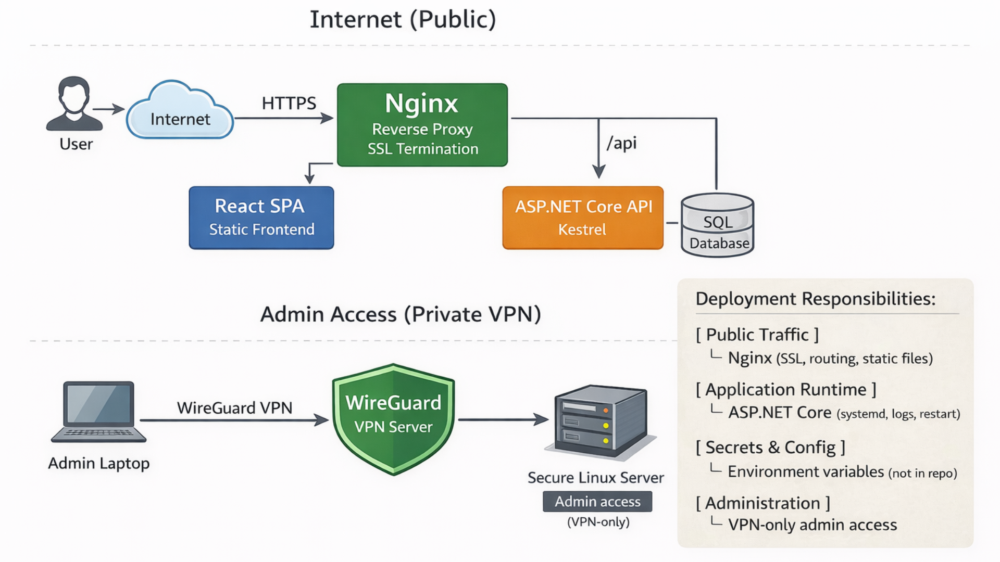

# 🎓 Faculty Alumni Platform - Public Showcase

A production-oriented alumni management platform built with ASP.NET Core and React,  
focused on secure application flows, data integrity, and real-world deployment practices.

> **Public Showcase / Subset**
>
> This repository contains a curated public subset of the project (selected modules, docs, and examples).
> The full production codebase is **private**.
>
> ✅ No secrets (keys, connection strings, tokens) are included.  
> ✅ No institution-specific data, naming, or internal infrastructure details are included.  
> ✅ UI/branding and production deployment configuration are intentionally omitted.

---

## What’s included in this public showcase

- **Backend:** selected API modules (DTOs, services, helpers) covering validation, geocoding, and secure application handling  
- **Frontend:** interactive map component (Leaflet) with example integration  
- **Security & anti-abuse:** CAPTCHA verification, honeypot protection, rate limiting, and role-based authorization concepts  
- **Data integrity:** database constraints, normalized email handling, and transactional write patterns  
- **Reliability patterns:** email outbox approach and retry-safe background processing concepts  
- **Configuration & deployment awareness:** environment-based configuration and reverse-proxy-ready architecture  
- **Documentation:** architecture notes, flow diagrams, and engineering decisions  
- **Tests:** minimal test coverage for representative modules

---

## 📖 About the Project

The Alumni Platform transforms how the Medical Faculty interacts with its graduates.  
Replacing outdated lists and manual workflows, the system provides a modern, interactive,  
and production-oriented digital experience built with ASP.NET Core and React.

Users can:

- Create professional profiles and become **verified members** of the organization  
- Visualize global Alumni presence via an **interactive world map**  
- Access an exclusive **job board** and read inspiring **Alumni Stories**  
- Benefit from automation (**geolocation, verification**) and scalable data handling (**caching, background processing**)
- View financial reports and subscription statuses through an **administrative dashboard**
- Register online for **congresses and educational events**  

The platform is designed with a strong focus on **security, data integrity, and real-world deployment practices**,  
reflecting production requirements rather than demo-level functionality.

---

## 🚧 Roadmap / Planned features

Planned improvements focus on extending production capabilities and long-term scalability:

- Advanced analytics and reporting dashboards for administrative insights  
- Extended event management workflows and participant automation  
- Improved background job processing and notification reliability  
- Enhanced security hardening, auditing, and monitoring capabilities  
- Performance optimization and caching strategy expansion

---

## 🏗️ Architecture

High-level production architecture showing public traffic flow,
reverse proxy termination, application runtime, database boundary,
and VPN-restricted administrative access.

---
## 🚀 Key Challenges & Solutions

<strong>1. Intelligent Geocoding & Fallback-First Caching</strong>

 

One of the primary engineering goals was to accurately map users worldwide  
without overloading external APIs, while still handling typos and imperfect  
data entry gracefully.

The solution combines **normalized search keys**, **local caching**, and  
a **fallback-first resolution strategy** to ensure both reliability and  
performance in real-world conditions.

#### Geocoding Workflow Diagram

### 🔑 Key files

- 🧠 **Geocoding Core Logic**  
  [`GeocodingService.ResolveLocationAsync`](code/backend/Services/Geocoding/GeocodingService.cs)  
  *Handles cache lookup, external API resolution, and fallback persistence.*

- 🧩 **Cache Key Normalization**  
  [`StringHelper.GenerateSearchKey`](code/backend/Helpers/StringHelper.cs)  
  *Applies trimming, lowercasing, whitespace collapse, and diacritics removal  
  to maximize cache hit consistency.*

- 🧭 **Application Endpoints**  
  [`MembershipController.SubmitApplication`](code/backend/Controllers/MembershipController.cs)  
  [`MembershipController.GetMap`](code/backend/Controllers/MembershipController.cs)  
  *Processes membership applications and serves map visualization data.*

- ⚙️ **Service Configuration**  
  [`Program.cs`](code/backend/Program.cs)  
  *Registers geocoding services and HttpClient dependencies via DI.*

- 🗄 **Data Integrity Guarantees**  
  [`sql_constraints.sql`](infra/sql/sql_constraints.sql)  
  *Database constraints prevent duplicate or inconsistent location records.*

➡️ Details: [`docs/geocoding.md`](docs/geocoding.md)

---

<strong>2. Async Email Delivery (Outbox Pattern + Background Worker)</strong>

 

To prevent slow or unreliable SMTP providers from blocking API requests,  
email delivery is fully **decoupled from the request lifecycle** using a  
**database-backed outbox** and an asynchronous **background worker**.

This design ensures:

- **request responsiveness** (no direct SMTP calls in the API path)  
- **at-least-once delivery guarantees** with retry/backoff logic  
- **failure isolation** between user actions and infrastructure issues  

#### Email Outbox Workflow Diagram

### 🔑 Key files

- 📩 **Outbox Insert (API layer)**  
  [`MembershipController.SubmitApplication`](code/backend/Controllers/MembershipController.cs)  
  *Creates an email event and persists it in the EmailOutbox table instead  
  of sending immediately.*

- 🔁 **Background Worker Processing**  
  [`EmailOutboxWorker`](code/backend/Services/Email/EmailOutboxWorker.cs)  
  *Polls pending messages, sends emails asynchronously, and updates status.*

- 🔄 **Retry & Backoff Strategy**  
  [`EmailOutboxWorker.GetNextDelay`](code/backend/Services/Email/EmailOutboxWorker.cs)  
  *Implements progressive retry scheduling and terminal failure handling.*

- ✉️ **SMTP Abstraction Layer**  
  [`IEmailSender`](code/backend/Services/Email/IEmailSender.cs)  
  *Decouples transport implementation from API and worker logic.*

- 🧾 **Idempotency & Consistency**  
  [`sql_constraints.sql`](infra/sql/sql_constraints.sql)  
  *Prevents duplicate message processing and enforces data consistency.*

- ⚙️ **Service Registration**  
  [`Program.cs`](code/backend/Program.cs)  
  [`EmailingExtensions.cs`](code/backend/Helpers/EmailingExtensions.cs)  
  *Registers the worker and email services via Dependency Injection.*

➡️ Details: [`docs/email-outbox.md`](docs/email-outbox.md)

---
## 🛠 Tech Stack

### Backend
- **.NET 8 (ASP.NET Core Web API)** - service-oriented architecture  
- **Entity Framework Core** - Code-First approach  
- **SQL Server** - relational database  
- **Dependency Injection** + **Repository Pattern**

### Frontend
- **React** - SPA (Single Page Application)  
- **Leaflet / React-Leaflet** - map rendering

### Integrations
- **Nominatim (OpenStreetMap)** - location geocoding  

---

## 🏗 Production Deployment 

> ⚠️ **Note**
>
> Production deployment configuration, infrastructure credentials, and automation scripts  
> are intentionally **excluded** from this public repository.

The Alumni Platform is deployed on a **private Linux VPS** using a traditional yet robust production setup, designed for clarity, security, and full control.
Public traffic goes through HTTPS via Nginx.  
The application runs behind the reverse proxy, while administrative access is restricted to a private VPN network.

### Deployment Overview

- **Operating System:** Linux (Ubuntu Server)
- **Web Server:** Nginx (reverse proxy + static file hosting)
- **Backend:** ASP.NET Core (.NET 8) running as a `systemd` service
- **Frontend:** React (Vite) built artifacts served via Nginx
- **Database:** Microsoft SQL Server (Linux)
- **SSL:** Let’s Encrypt (Certbot)
- **Process Management:** `systemd`
- **Secrets Management:** environment variables (not committed)

### Access & Security Model

- 🔐 Direct server access is restricted
- 🔒 Administrative access is performed via **SSH**, optionally tunneled through **WireGuard VPN**
- 🚫 No production secrets are stored in the repository
- 🧩 Environment-specific configuration is injected at runtime

### Deployment Workflow (Simplified)

1. **Frontend**
   - React app is built locally (`npm run build`)
   - Static `dist/` artifacts are uploaded to the VPS
   - Nginx serves the SPA with strict API routing rules

2. **Backend**
   - ASP.NET Core application is published as a release build (`dotnet publish -c Release`)
   - Runs as a managed `systemd` service
   - Background workers (Email Outbox) start automatically

3. **Database**
   - SQL Server database restored from backup
   - Application-specific database user with limited permissions

### Why This Matters

This deployment approach emphasizes:
- ✅ Predictable production behavior
- ✅ Clear separation of concerns (frontend / backend / database)
- ✅ Secure handling of credentials
- ✅ Infrastructure understanding beyond local development

