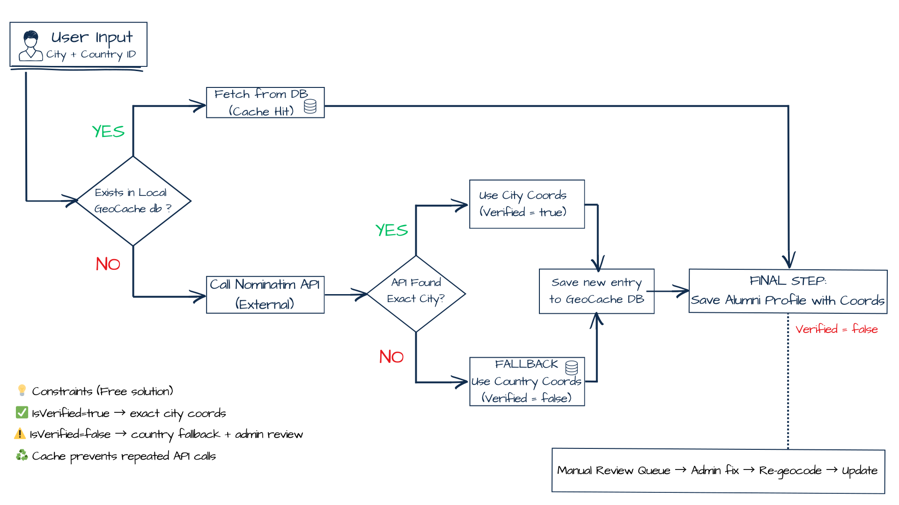

# 🎓 Faculty Alumni Platform - Public Showcase

A production-oriented alumni management platform built with ASP.NET Core and React,  
focused on secure application flows, data integrity, and real-world deployment practices.

> **Public Showcase / Subset**
>
> This repository contains a curated public subset of the project (selected modules, docs, and examples).
> The full production codebase is **private**.
>
> ✅ No secrets (keys, connection strings, tokens) are included.  
> ✅ No institution-specific data, naming, or internal infrastructure details are included.  
> ✅ UI/branding and production deployment configuration are intentionally omitted.

---

## What’s included in this public showcase

- **Backend:** selected API modules (DTOs, services, helpers) covering validation, geocoding, and secure application handling  
- **Frontend:** interactive map component (Leaflet) with example integration  
- **Security & anti-abuse:** CAPTCHA verification, honeypot protection, rate limiting, and role-based authorization concepts  
- **Data integrity:** database constraints, normalized email handling, and transactional write patterns  
- **Reliability patterns:** email outbox approach and retry-safe background processing concepts  
- **Configuration & deployment awareness:** environment-based configuration and reverse-proxy-ready architecture  
- **Documentation:** architecture notes, flow diagrams, and engineering decisions  
- **Tests:** minimal test coverage for representative modules

---

## 📖 About the Project

The Alumni Platform transforms how the Medical Faculty interacts with its graduates.  
Replacing outdated lists and manual workflows, the system provides a modern, interactive,  
and production-oriented digital experience built with ASP.NET Core and React.

Users can:

- Create professional profiles and become **verified members** of the organization  
- Visualize global Alumni presence via an **interactive world map**  
- Access an exclusive **job board** and read inspiring **Alumni Stories**  
- Benefit from automation (**geolocation, verification**) and scalable data handling (**caching, background processing**)
- View financial reports and subscription statuses through an **administrative dashboard**
- Register online for **congresses and educational events**  

The platform is designed with a strong focus on **security, data integrity, and real-world deployment practices**,  
reflecting production requirements rather than demo-level functionality.

---

## 🚧 Roadmap / Planned features

Planned improvements focus on extending production capabilities and long-term scalability:

- Advanced analytics and reporting dashboards for administrative insights  
- Extended event management workflows and participant automation  
- Improved background job processing and notification reliability  
- Enhanced security hardening, auditing, and monitoring capabilities  
- Performance optimization and caching strategy expansion

---

## 🛠 Tech Stack

### Backend
- **.NET 8 (ASP.NET Core Web API)** - service-oriented architecture  
- **Entity Framework Core** - Code-First approach  
- **SQL Server** - relational database  
- **Dependency Injection** + **Repository Pattern**

### Frontend
- **React** - SPA (Single Page Application)  
- **Leaflet / React-Leaflet** - map rendering

### Integrations
- **Nominatim (OpenStreetMap)** - location geocoding  

---

## 🚀 Key Challenges & Solutions

<strong>1. Intelligent Geocoding & Fallback-First Caching</strong>

 

One of the primary engineering goals was to map users worldwide accurately without overloading external APIs, while still handling typos and imperfect data entry gracefully.

#### Geocoding Workflow Diagram

### 💻 Implementation shortcuts

- 🧠 **Geocoding Core Logic**  
  [`GeocodingService.ResolveLocationAsync`](backend/src/AlumniApi/Services/Geocoding/Geocoding.cs)  
  *The heart of the system: handles local cache checks, API requests, and fallback saving.*

- 🧩 **Cache Key Generator**  
  [`StringHelper.GenerateSearchKey`](backend/src/AlumniApi/Helpers/StringHelper.cs)  
  *Normalizes city and country names to ensure cache hits.*

- 🧭 **API Controllers**  
  [`MembershipController.SubmitApplication`](backend/src/AlumniApi/Controllers/MembershipController.cs) &  
  [`GetMap`](backend/src/AlumniApi/Controllers/MembershipController.cs)  
  *Endpoints for processing applications and serving map data.*

- ⚙️ **Service Configuration**  
  [`Program.cs`](backend/src/AlumniApi/Program.cs)  
  *Dependency Injection and HttpClient setup.*

➡️ Details: [`docs/geocoding.md`](docs/geocoding.md)

---

<strong>2. Async Email Delivery (Outbox Pattern + Background Worker)</strong>

 

To prevent slow or unreliable SMTP servers from blocking API requests, email delivery is fully decoupled from the request lifecycle using a DB-backed outbox and a background worker.

#### Email Outbox Workflow Diagram

### 💻 Implementation shortcuts

- 📩 **Outbox Insert (API layer)**  
  [`MembershipController.SubmitApplication`](backend/src/AlumniApi/Controllers/MembershipController.cs)  
  *Creates the email message and inserts it into the EmailOutbox table (no direct SMTP call).*

- 🔁 **Background Worker**  
  [`EmailOutboxWorker`](backend/src/AlumniApi/Services/Email/EmailOutboxWorker.cs)  
  *Periodically polls pending outbox records and sends emails asynchronously.*

- 🔄 **Retry & Backoff Logic**  
  [`EmailOutboxWorker.GetNextDelay`](backend/src/AlumniApi/Services/Email/EmailOutboxWorker.cs)  
  *Handles retry scheduling and marks emails as Failed after max attempts.*

- ✉️ **SMTP Abstraction**  
  [`IEmailSender`](backend/src/AlumniApi/Services/Email/IEmailSender.cs)  
  *Encapsulates SMTP transport and keeps API and worker decoupled from the provider.*

- ⚙️ **Service Configuration**  
  [`Program.cs`](backend/src/AlumniApi/Program.cs) |
  [`EmailingExtensions.cs`](backend/src/AlumniApi/Helpers/EmailingExtensions.cs)
  *Registers the background worker and SMTP sender via Dependency Injection.*

➡️ Details: [`docs/email-outbox.md`](docs/email-outbox.md)

## 🏗 Production Deployment 

> ⚠️ **Note**
>
> Production deployment configuration, infrastructure credentials, and automation scripts  
> are intentionally **excluded** from this public repository.

The Alumni Platform is deployed on a **private Linux VPS** using a traditional yet robust production setup, designed for clarity, security, and full control.
Public traffic goes through HTTPS via Nginx.  
The application runs behind the reverse proxy, while administrative access is restricted to a private VPN network.

### Deployment Overview

- **Operating System:** Linux (Ubuntu Server)
- **Web Server:** Nginx (reverse proxy + static file hosting)
- **Backend:** ASP.NET Core (.NET 8) running as a `systemd` service
- **Frontend:** React (Vite) built artifacts served via Nginx
- **Database:** Microsoft SQL Server (Linux)
- **SSL:** Let’s Encrypt (Certbot)
- **Process Management:** `systemd`
- **Secrets Management:** environment variables (not committed)

### Access & Security Model

- 🔐 Direct server access is restricted
- 🔒 Administrative access is performed via **SSH**, optionally tunneled through **WireGuard VPN**
- 🚫 No production secrets are stored in the repository
- 🧩 Environment-specific configuration is injected at runtime

### Deployment Workflow (Simplified)

1. **Frontend**
   - React app is built locally (`npm run build`)
   - Static `dist/` artifacts are uploaded to the VPS
   - Nginx serves the SPA with strict API routing rules

2. **Backend**
   - ASP.NET Core application is published as a release build (`dotnet publish -c Release`)
   - Runs as a managed `systemd` service
   - Background workers (Email Outbox) start automatically

3. **Database**
   - SQL Server database restored from backup
   - Application-specific database user with limited permissions

### Why This Matters

This deployment approach emphasizes:
- ✅ Predictable production behavior
- ✅ Clear separation of concerns (frontend / backend / database)
- ✅ Secure handling of credentials
- ✅ Infrastructure understanding beyond local development

