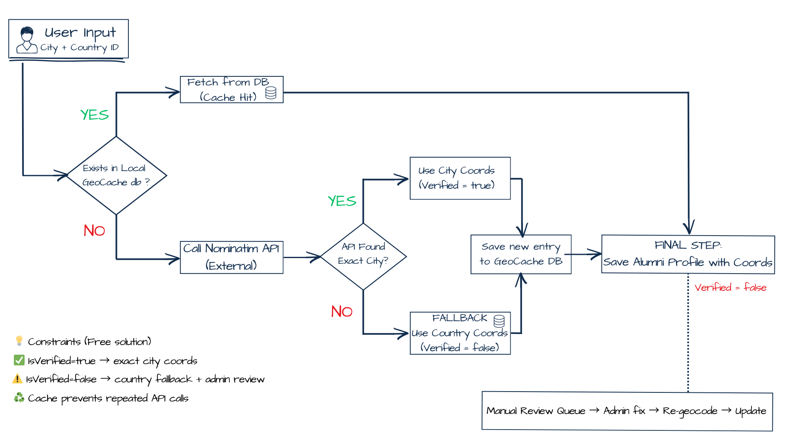

### Intelligent Geocoding & Fallback-First Caching

One of the primary engineering goals was to map users worldwide accurately without overloading external APIs, while ensuring no profile ever remains "locationless" due to typos or API failures.

To solve this, I implemented a **"Fallback-First" Caching Strategy**:

1.  **🔍 Cache Lookup (Layer 1)**
    The system first checks the local `GeoCache` using a composite key (`City|Country`). If found, it serves the coordinates immediately (**0 API calls**).

2.  **🛡️ Immediate Fallback (Safety Net)**
    If the city is missing from the cache, the system **immediately creates a database record** using the *Country's* known center coordinates and flags it as `IsVerified = false`.
    * *Result:* This guarantees the user is mapped instantly, even before the external request is made.

3.  **📡 API Refinement (Layer 2)**
    Only after the fallback is secured does the system query the **Nominatim API** in the background.

4.  **✅ Verification & Update**
    * **Success:** If the API resolves the exact city, the database record is **updated** with the precise coordinates and set to `IsVerified = true`.
    * **Failure (Typo/Error):** The system silently keeps the previously saved Country coordinates. The profile remains functional on the map but is flagged for **admin review**.

> **📉 Impact:** This architecture ensures **100% data availability**. Every user is mapped immediately (at least to their country level), while API usage is minimized strictly to new, unique locations.

#### Geocoding Workflow Diagram

## 🔗 Key code references

### Backend (API)
- 🧠 **Geocoding service (core flow):** - [`GeocodingService.cs`](../code/backend/src/AlumniApi/Services/Geocoding/Geocoding.cs)
  - Interface: [`IGeocodingService.cs`](../code/backend/src/AlumniApi/Services/Geocoding/IGeocoding.cs)

- 🧩 **Normalization / cache-key:** - [`StringHelper.cs`](../code/backend/src/AlumniApi/Helpers/StringHelper.cs)

- 🧾 **Endpoint that triggers geocoding:** - `POST /api/membership/apply` → [`MembershipController.cs`](../code/backend/src/AlumniApi/Controllers/MembershipController.cs)

- 🌍 **Map data endpoint:** - `GET /api/membership/map` → [`MembershipController.cs`](../code/backend/src/AlumniApi/Controllers/MembershipController.cs)

- 🗃️ **Data models / caching table:** - [`GeoCache model`](../code/backend/src/AlumniApi/Models/GeoCache.cs)  
  - (optional) DbContext: [`AlumniContext`](../code/backend/src/AlumniApi/Models/AlumniContext.cs)

- 🌐 **Country fallback seed (default country coordinates):**
  - [`001_countries.sql`](../code/backend/scripts/001_countries.sql)
    
- ⚙️ **HttpClient configuration:** - [`Program.cs`](../code/backend/src/AlumniApi/Program.cs)

- 🧪 **Unit Testing (QA):** - [`GeocodingTests.cs`](../code/backend/tests/GeocodingTests.cs) _(Validates cache hits, API integration & fallback logic)_

### Frontend (World Map)
- 🗺️ **World map component:** - [`WorldMap` / `MapPage`](../code/frontend/src/components/WorldMap/WorldMap.jsx)

### 💡 Why this approach? (Project Constraints & Quality Assurance)
This architecture was specifically chosen to meet two critical client requirements:
1.  **Zero-Cost Operation:** The client required a sustainable system without recurring monthly costs (e.g., Google Maps API billing). Using Nominatim (OpenStreetMap) solved this but required strict rate-limiting and caching.
2.  **100% Data Integrity:** While automation handles 95% of cases, the "Admin Review" feature ensures that no user is ever lost or mapped incorrectly due to API limitations.
    * *Note:* Critical logic (such as the fallback mechanism) is covered by **Unit Tests** to prevent regression.
    *  Country-level fallback coordinates come from a small reference dataset seeded via
[`001_countries.sql`](../code/backend/scripts/001_countries.sql).

