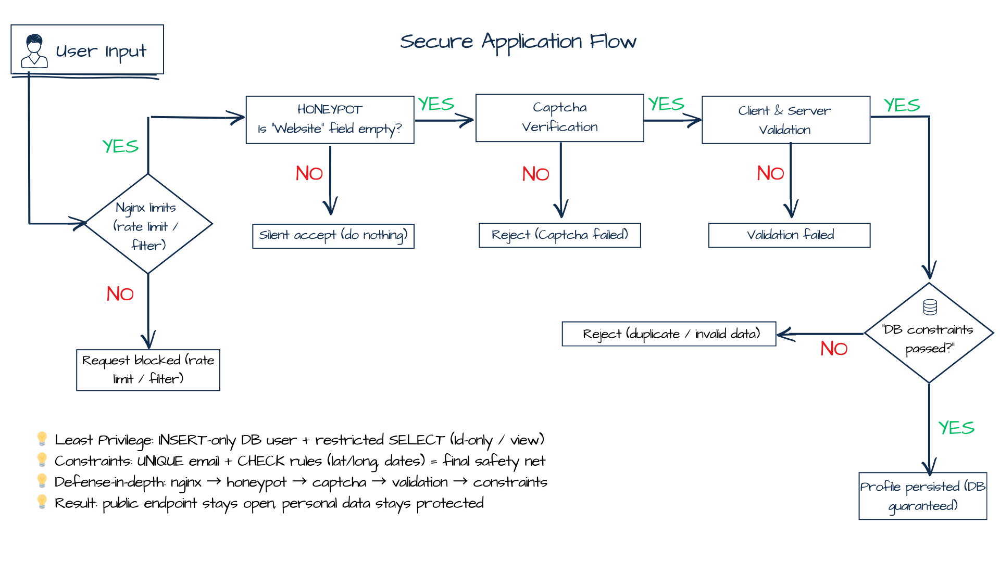

### Secure Public Application Flow (Anti-Abuse & Data Protection)

Public membership applications represent the most exposed surface of the system.  
The core engineering challenge was to allow **open access for legitimate users**  
while preventing:

- automated bot submissions  
- duplicate or malicious requests  
- unauthorized exposure of sensitive personal data  

To address this, the system implements a **layered protection model** spanning  
the browser, API, database, and reverse-proxy infrastructure.

---

## 🛡️ Layered Security Strategy

1. **🧪 Honeypot Detection (Layer 1 – Silent Bot Filter)**  
   A hidden form field (`Website`) is included in the public form.  
   - Legitimate users never fill this field.  
   - Bots that auto-populate inputs are immediately detected.  
   - The request is accepted silently but **ignored**, preventing signal leakage.

2. **🤖 CAPTCHA Verification (Layer 2 – Human Proof)**  
   Before any processing occurs, the API validates a CAPTCHA token.  
   - Blocks automated submissions early.  
   - Prevents unnecessary database or email operations.

3. **✅ Client & Server Validation (Layer 3 – Data Correctness)**  
   Validation is enforced in **two independent layers**:
   - **Client-side:** immediate UX feedback and basic format checks.  
   - **Server-side:** authoritative validation ensuring correctness even if the client is bypassed.  
   - **Database constraints:** final structural guarantees preventing invalid persistence.

4. **🔒 Least-Privilege Database Access (Layer 4 – Data Protection)**  
   The application database user is strictly limited:
   - **INSERT-only** access to `AlumniProfiles` for public submissions.  
   - **No direct SELECT** on sensitive personal data (email, phone, birth date).  
   - Public map queries are served through a **sanitized database view** exposing  
     only geographic coordinates and non-sensitive metadata.

5. **🌐 Reverse-Proxy Rate Limiting (Layer 5 – Abuse Prevention)**  
   Nginx enforces per-IP request throttling:
   - General API rate limits.  
   - **Stricter limits** for the public `/apply` endpoint.  
   - Protection against burst submissions and scripted attacks  
     before traffic even reaches the application.

---

## 📉 Security Impact

This architecture ensures:

- **Bot resistance** without degrading user experience  
- **Protection of personal data** through least-privilege access and data minimization  
- **Graceful handling of malicious traffic** at the infrastructure boundary  
- **Defense-in-depth**, where failure of one layer does not compromise the system  

> Public input is never trusted.  
> Every request must pass **multiple independent verification layers**  
> before it can affect persistent data.

---

#### Secure Application Flow Diagram

---

## 🔗 Key code references

### Backend (API)

- 🛡️ **Application endpoint & anti-abuse logic:**  
  `POST /api/membership/apply` →  
  [`MembershipController.cs`](../code/backend/src/AlumniApi/Controllers/MembershipController.cs)

- 🤖 **CAPTCHA verification service:**  
  [`CaptchaService`](../code/backend/src/AlumniApi/Services/Security)

- ✅ **DTO validation & rules:**  
  [`MembershipApplicationDto.cs`](../code/backend/src/AlumniApi/DTOs/MembershipDto/MembershipApplicationDto.cs)

- 🧱 **Database integrity constraints:**  
  [`sql_constraints.sql`](../infra/sql/sql_constraints.sql)

- 🔒 **Least-privilege permissions:**  
  [`sql_permissions.sql`](../infra/sql/sql_permissions.sql)

---

### Infrastructure

- 🌐 **Reverse proxy rate limiting & filtering:**  
  [`nginx.example.conf`](../infra/nginx/nginx.example.conf)

---

## 💡 Why this approach?

This security model was designed to satisfy two critical real-world requirements:

1. **Public accessibility with strong abuse resistance**  
   The application must remain openly reachable without allowing  
   automated spam or scripted attacks to degrade system reliability.

2. **Strict protection of personal data**  
   Sensitive user information must never be exposed unnecessarily.  
   The combination of **least-privilege DB access**, **sanitized views**,  
   and **multi-layer validation** ensures compliance with privacy  
   and data-minimization principles.

As a result, the public application flow remains **simple for users**,  
yet **defensively engineered** across every architectural layer.
